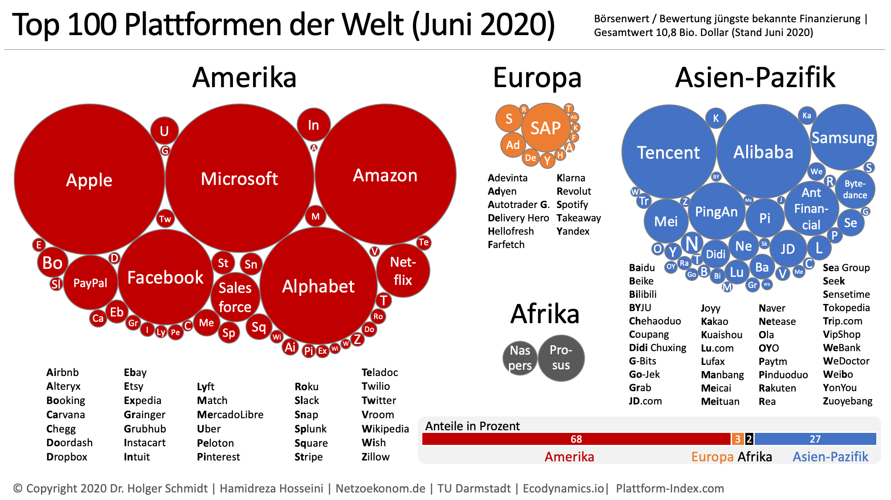
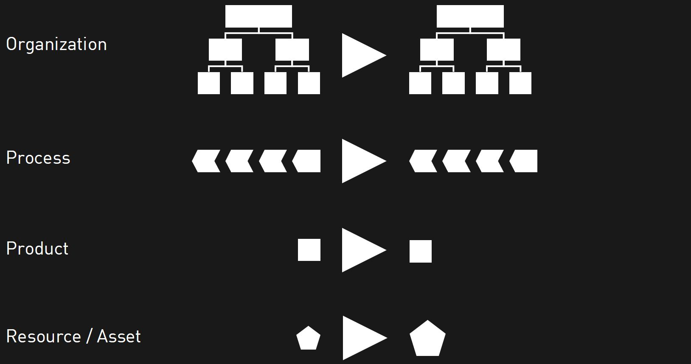
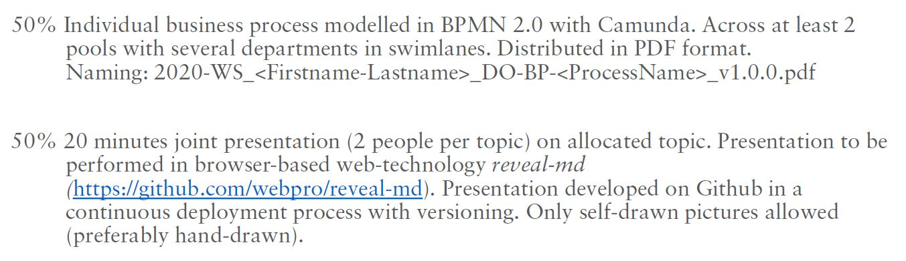

# Digital Organization

v1.3.0

> "Experience rather then watch!"
>
> — Ulrich Anders

---

## Innovation?

---

## Adventure?

[https://www.pechakucha.com/presentations/a-quest-for-adventure](https://www.pechakucha.com/presentations/a-quest-for-adventure)

---

## Adventure

> "Getting out of the comfort zone: mentally, socially, spiritually, physically"
>
> — Allister Humphry

---

## WHY



---

## ORGANIZATIONAL ELEMENTS



---

## WHAT

- Structural Organization
- Process Organization
- Cooperation Model
- Continuous Deployment

---

## HOW

- (Markdown)
- Understanding digital workflow
- GitHub
- BPMN
- Ideal Organization
- Your own orgchart

---

## CHALLENGE

- Technology
- Rights
- Computers

---

## BLOG

[https://github.blog/2020-09-10-announcing-the-github-integration-with-microsoft-teams/](https://github.blog/2020-09-10-announcing-the-github-integration-with-microsoft-teams/)

---

## Coursework



---

#### 08.10.2020

- What is going on on my PC MH + MP
- Github Organization JS + VK
- Path Dependency OA + GK

---

#### 15.10.2020

- Ownership MN + ET
- Network Effects ME + MK

---

#### 22.10.2020

- Hierarchy (a natural order?) VO + SiS
- Hierarchy (the mechanism of power) JM + KW
- Hierarchy (the good, the bad, and the evil) CP + WOK

---

#### 29.10.2020

- Exponential Organization FB + LH
- Ambidextrous Organization NG + LR
- Holacracy GHK + PP

---

#### 05.11.2020

- Reinventing Organization CH + KZ
- Morningstar, Sipgate UA

---

### Dropped

- Continuous Deployment

---

### Understand Terminal Commands


1. [kesavanbr_pocket-guide-linux-commands.pdf](kesavanbr_pocket-guide-linux-commands.pdf)

1. [Linux-commands-cheatsheet.pdf](Linux-commands-cheatsheet.pdf)

1. [davechild_linux-command-line.pdf](davechild_linux-command-line.pdf)


---

### Objectives

We want to achieve the following situation:

* Each of you has a GitHub account.
* In this account is an individual repository that is cloned as a folder onto your local harddrive, e.g. `2020-ws_doxy`
* In this locally cloned folder is a test file with your test presentation `slides.md`  for you to practice working with `VS Code`, `reveal-md`, `GitHub Desktop`, `commits`, `push` and of course `Markdown`.

---

### Objectives (ctd.)

* Then you and your partner will use one of your accounts to setup a joint repository `2020-ws_doabcd` for your coursework.
* You can then both commit to this common folder.
* On the day of your presentation, clone the common repository to a local harddrive and present it.

---

### Pre-requisites |

Backup your computers properly.

Please install the following software:

- VS Code: https://code.visualstudio.com/

- PCs: git: https://git-scm.com/

- GitHub Desktop: https://desktop.github.com/

---

### Pre-requisites ||

Please install the following software:

- Chrome: https://www.google.com/chrome/?brand=CHBD&gclid=EAIaIQobChMI7L6QysrR6wIVYoBQBh04vgqJEAAYASAAEgIygvD_BwE&gclsrc=aw.ds

- XnView MP, if you want to edit pictures: https://www.xnview.com/en/

- For drawing pictures you can use Powerpoint or Paint 3D

---

### Test git

- Open command shell / terminal. Type

  ```sh
  git --version
  ```

* If further installations are necessary, e.g. Mac Developer Tools, please carry them out.

---

### Node

- Install node 12.18.4 LTS: https://nodejs.org/en/

- Open command shell:

  ```sh
  node --version
  ```

* React to error messages if there are any. You might need to give permissions:

  [https://docs.npmjs.com/resolving-eacces-permissions-errors-when-installing-packages-globally](https://docs.npmjs.com/resolving-eacces-permissions-errors-when-installing-packages-globally)

---

### GitHub

Sign on into GitHub.

Recommendation is to use firstnamelastname in small letters or a similar name as user name: https://github.com/

Enter this account also in GitHub Desktop.

---

### GitHub Repository

Make a new GitHub Repository on GitHub, e.g. `2020-ws_doxy`, where you replace xy with your initials.

Clone this repository onto your local harddrive. For this you can use `GitHub Desktop` or

```sh
git clone path-to-your-repository.git
```

---

### slides.md

Generate a `slides.md` file in the locally cloned folder. As a first content you can use the content from [https://github.com/webpro/reveal-md](https://github.com/webpro/reveal-md), i.e.

```md
# Title

- Point 1
- Point 2

---

## Second slide

> Best quote ever.

Note: speaker notes FTW!
```

### reveal-md

You are going to use `reveal-md`.

Open the terminal and install globally by:

```sh
npm install -g reveal-md
```

If you get access errors messages, fix them. See slide **Node**.

Afterwards, please read:

https://github.com/webpro/reveal-md

---

### Camunda

Please also download

- Camunda: https://camunda.com/download/modeler/

---

### Markdown

Play around with Markdown (we will cover this also in the lecture!)

https://www.markdownguide.org/getting-started/

https://github.com/adam-p/markdown-here/wiki/Markdown-Cheatsheet

https://code.visualstudio.com/docs/languages/markdown

### Markdown (text formatting)

**bold**

~~strikethrough~~

_italics_

---

### Markdown (bullets)

```md
- bullet
- more bullets
  - indented
  - bullets
```

- bullet
- more bullets
  - indented
  - bullets

---

### Markdown (lists)

```md
1. Don't get
1. confused
1. markdown counts up
1. and 1. is a command.
```

1. Don't get
1. confused
1. markdown counts up
1. and 1. is a command.

---

### Markdown (headers)

# # H1

## ## H2

### ### H3

#### #### H4

##### ##### H5

###### ###### H6

---

### Markdown (images)

```md

```


---

### Markdown (links)

```md
[https://ulrich-anders.eu](https://ulrich-anders.eu)
```

[https://ulrich-anders.eu](https://ulrich-anders.eu)
